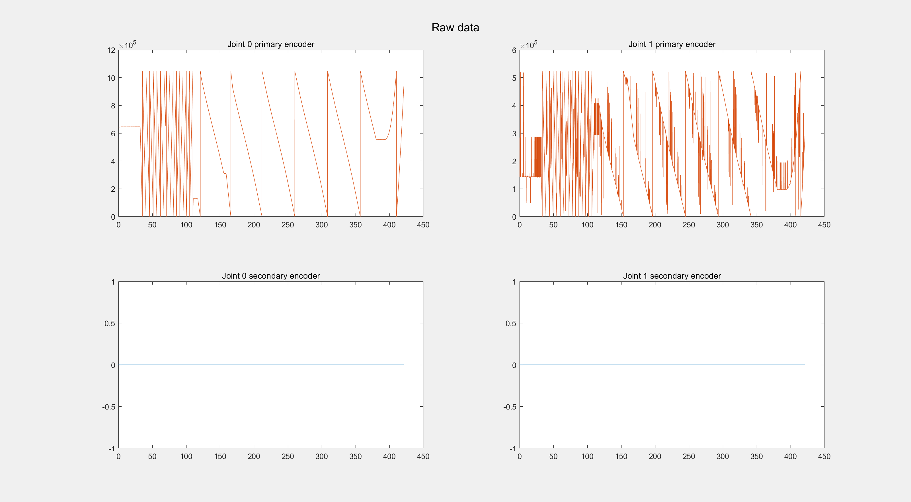
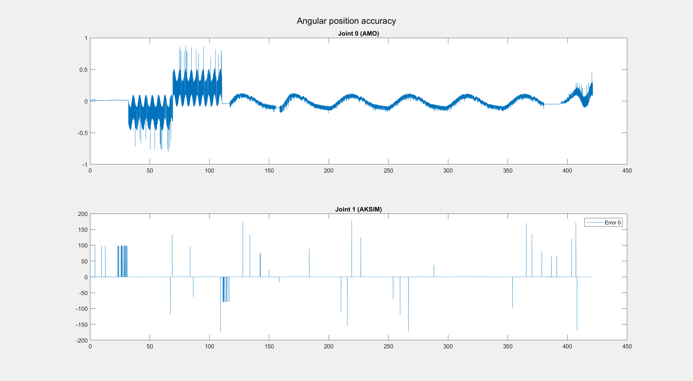
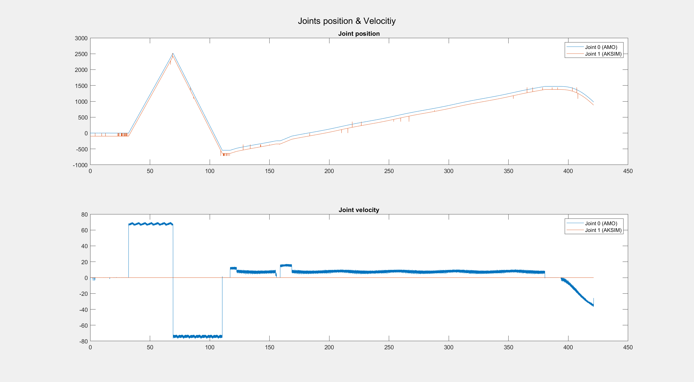
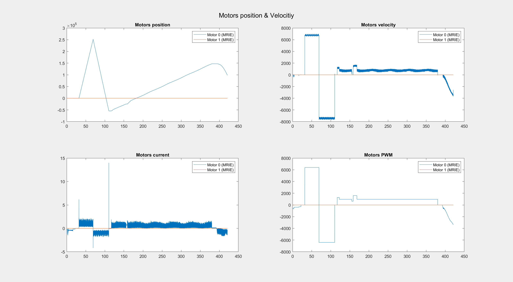
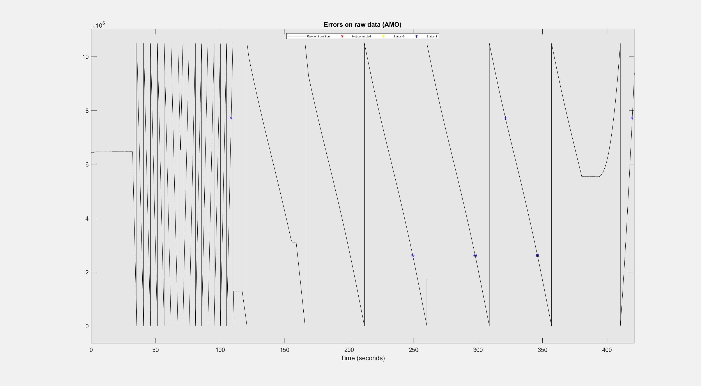

# Multijoint setup handler

## Running the Script
To run the script, open `multijoint_setup_handler.m` and execute it. This script calls several essential functions listed below:

## Key Functions:
- **`LoadData(robometry_data_path)`**: Loads robometry data from `.mat` files into `experiment_data`.
- **`GetTimestamps(experiment_data)`**: Retrieves experiment timestamps for analysis and plotting.
- **`GetNumberOfJoints(experiment_data)`**: Returns the number of joints used in the experiment.
- **`DefineMotorStruct(experiment_data)`**: Constructs a structure containing motor data.
- **`DefineJointStruct(experiment_data)`**: Constructs a structure containing joint data.
- **`GetRawData(experiment_data)`**: Extracts raw encoder data.
- **`SetReductionsRatio(joint_struct, r_ratio_1, ..., r_ratio_N)`**: Sets reduction ratios for joint gearboxes.
- **`SetEncodersResolution('encoder_1_name', encoder_1_resolution, ..., 'encoder_3_name', encoder_3_resolution)`**: Sets encoder resolution values ('aksim', 'amo', 'mrie' supported).
- **`SetEncoderTypeDiagnostic(experiment_data, 'encoder_i_name')`**: Retrieves and analyzes diagnostic data for the specified encoder ('aksim' implemented; 'amo' and 'mrie' pending).

By combining these functions, many different types of analysis can be performed.
The code can be used for analysis tasks, but it can definitely be reorganised to make it more usable for people who are not really familiar with MatLab.

## Additional Plotting Functions:
Additionally, the script includes plotting functions:
- **`PlotRawData`**: Plots raw encoder data.

- **`PlotError`**: Plots the difference between measured and theoretical joint positions.

- **`PlotJointPosVel`**: Plots joint positions and velocities.

- **`PlotMotorStates`**: Plots motor position, velocity, current, and PWM.

- **`PlotDiagnostic`**: Visualizes diagnostic values on raw data for better understanding.

## Error percentage calculation:
The script generates a Markdown table summarizing the calculated percentage errors for each encoder type.  
Below are examples for two diagnostic cases.
### Example (aksim diagnostic):
| Error Type (AKSIM)     | Percentage |
|------------------------|------------|
| Failed CRC             | 1.3315%     |
| C2L warning            | 0.0015%     |
| Invalid data error     | 0.0000%     |
| Sum of the errors      | 1.3331%     |
### Example (amo diagnostic):
| Error Type (AMO)       | Percentage |
|------------------------|------------|
| Status 0               | 0.0000%     |
| Status 1               | 0.0091%     |
| Not connected          | 0.0000%     |
| Total error            | 0.0091%     |