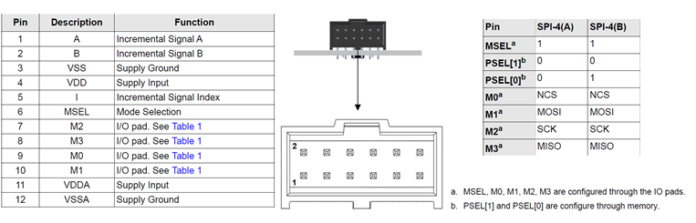

# AEAT-9922 Position and Diagnostics Reader

## :memo: Project Aims

This firmware provides a real-time diagnostic and position reading tool for the Broadcom AEAT-9922 magnetic encoder. At this stage (MVP0) the application operates using the sensor's **default SPI-4(A) communication protocol**. In the end, it will use **SPI-4(B)**.

The primary goal is to continuously read the sensor's absolute position, validate the data integrity using the provided parity bit, and report detailed error states by monitoring the error flag and querying the status register when necessary. All data is published via UART for easy monitoring on a serial terminal.

-----

## :gear: Key Features

  * **Absolute Position Reading**: Reads the 18-bit absolute angular position from the sensor.
  * **Parity Bit Verification**: For every 16-bit frame received, the firmware calculates the expected even parity and verifies it against the parity bit sent by the sensor.
  * **Error Flag Monitoring**: The firmware monitors the `EF` (Error Flag) bit in the SPI data frame.
  * **Detailed Error Reporting**: If the `EF` bit is high, the firmware performs a secondary read of the Status Register (`0x21`) to identify the specific nature of the error (e.g., Magnet High, Magnet Low, Memory Error).
  * **UART Data Logging**: All readings and status information are formatted into a human-readable string and transmitted over UART.

-----

## :electric\_plug: Hardware Setup

To use this firmware, you will need the following setup:

  * **Board**: A Nucleo series development board.
  * **Sensor**: An AEAT-9922 encoder IC.
  * **Magnet**: A diametrically magnetized two-pole magnet suitable for the sensor.
  * **Connections**:
      * Connect the sensor's SPI pins (NCS, SCK, MISO, MOSI) to the corresponding SPI peripheral pins on the Nucleo board.
      * **Crucially, the sensor's `MSEL` pin must be pulled HIGH (`1`)** to select the SPI-4 interface mode.
      * Connect a the Nucleo board to a USB peripheral.
      * Power the sensor and the board (3.3V or 5V is supported, ensure that the board receive power from the USB cable).

-----

## :rocket: How to use

1.  **Flash the Firmware**: Compile the project and flash the resulting binary onto the Nucleo board.
2.  **Open Serial Terminal**: Connect to the board using a serial terminal application (e.g., PuTTY, Tera Term, CoolTerm).
3.  **Configure Terminal**: Set the communication parameters to **115200 baud, 8-N-1** (8 data bits, no parity, 1 stop bit).
4.  **Power On & Observe**: Power the system. The firmware will start immediately, and you will see the sensor readings printed on the screen.

### :zap: Pinout



-----

## :bar\_chart: Interpreting the results

The output is designed to be clear and self-explanatory. Each line provides a complete snapshot of the sensor's state.

#### Normal Operation

When the sensor is operating correctly, the output will look like this:

```
Pos: 123456 | Angle: 171.23° | Parity: OK | Status: OK
```

  * **Pos**: The raw 18-bit absolute position value (0 to 262143).
  * **Angle**: The position converted to mechanical degrees.
  * **Parity**: Confirms that the received data frame passed the even parity check.
  * **Status**: Indicates no errors are currently active.

#### Error Condition

When an error occurs (e.g., you move the magnet too far away), the output will change to provide a specific diagnosis:

```
Pos: 0 | Angle: 0.00° | Parity: OK | Status: ERROR (MLO - Magnet Too Weak)
```

  * **Status**: This field will now display `ERROR` followed by the cause reported by the status register:
      * **MHI (Magnet Too Strong)**: The magnet is too close to the sensor.
      * **MLO (Magnet Too Weak)**: The magnet is too far from the sensor. This is the expected error when testing by moving the magnet away.
      * **MEM\_Err (Memory Error)**: The sensor's internal memory content is corrupted.

If the parity check fails, the output will immediately indicate it:

```
Pos: 234567 | Angle: 325.34° | Parity: FAIL | Status: DATA CORRUPTED
```